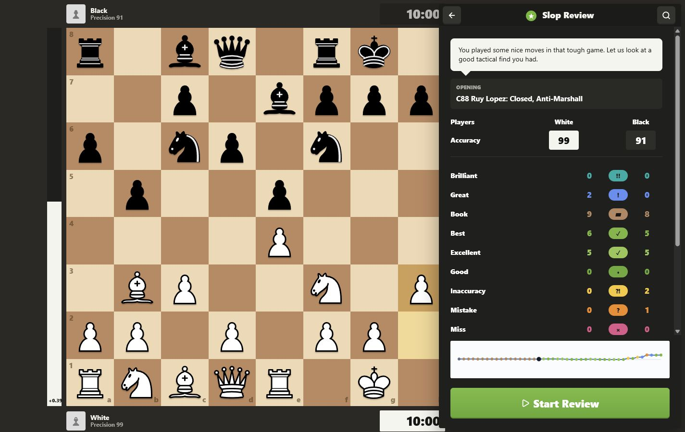

# Slop Review

A vibe coded game review clone for local chess PGNs. It runs Stockfish locally, labels moves, estimates accuracy and game rating, and walks through key moments in a Chess.com-ish review panel.



## Run

Windows:

```powershell
powershell -ExecutionPolicy Bypass -File .\start.ps1
```

macOS:

```bash
./start-macos.sh
```

Linux:

```bash
./start-linux.sh
```

Open `http://localhost:4173`.

The start script downloads Stockfish from the official GitHub release on first run if it is missing. Stockfish is not committed to this repo.
